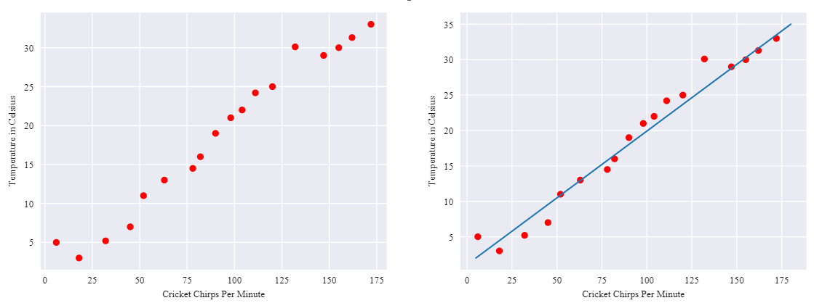
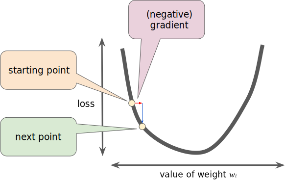
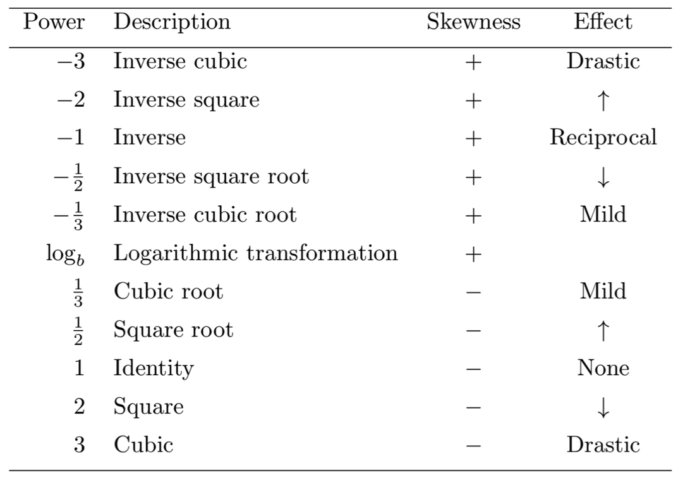
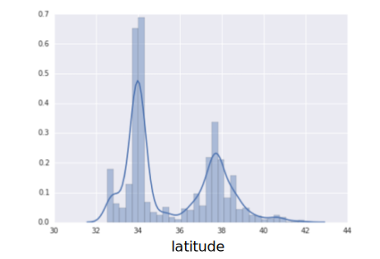
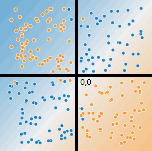
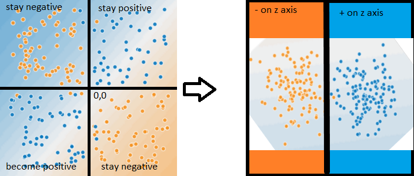

# THE BEGINING

[FRAMING](#FRAMING-ML-with-LINEAR-REGRESSION)

[LOSS FUNCTION](#A-LOSS-FUNCTION)

[REDUCING LOSS](#REDUCING-LOSS-AN-ITERATIVE-APPROACH)

[LEARNING RATE](#LEARNING-RATE)

[BATCH](#MINI-BATCH-AND-STOCHASTIC-GRADIENT-DESCENT)

[EPOCH](#EPOCH)

[SUMMARY OF HYPERPARAMTERES](#SUMMARY-OF-HYPER-PARAMETER-TUNING)

[GENERALISATION](#GENERALISATION)

[FEATURES](#REPRESENTATION-&-FEATURES)

[REGULARIZATION](#REGULARIZATION)

  

## FRAMING ML with LINEAR REGRESSION

Supervised ML systems learn how to combine input to produce useful predictions on never before seen data.

**Labels**: is the thing we're predicting. It's the `y variable` in linear regression

 

**Features**: is an input variable. It's the `x variable` in linear regression.

 

**Models**: defines the relationship between features and label
- **Training**: creating or learning the model. You show the model labeled examples and enable the model to gradually learn the relationships between features and label

- **Inference**: means applying the trained model to unlabeled examples
 

**Linear Regression**: a `Model` where linear combinations of `Features` are used to precited the `Label`.

where

- : the value we're trying to predict
- : the bias or y-intercept. the value for  when 
- : weigth applied to feature , also known as the slope. for every 1 increase in , also known as the slope. for every 1 increase in ,  increase by that amount
- : the feature

example:

Using the Feature "Chirps per Minute" to precited the Label "Temperature in Celsius". The `Model` is the line.

 

Linear regression can have multiple features all with their own weights:

  

## A LOSS FUNCTION

In supervised learning, a machine learning algorithm builds a model by examining many examples and attempting to find a model that minimizes loss; this process is called **empirical risk minimization**.

**Loss**: is the penalty for a bad prediction

**Mean Squared Error (L2 loss)**: a popular linear regression loss function for continuous labels

where:
-  is an example in which
    -  is the set of features
    -  is the example's label
-  is the output of the function of the weights and bias in combination with the set of features
-  is a data set containing many labeled examples
-  is the number of examples in 

High loss in the left model; low loss in the right model.

  

## REDUCING LOSS AN ITERATIVE APPROACH

Iterative strategies are common in machine learning because they scale well to large data sets

The simple STEPS:

1) initialise with random `intercept` and `weight` values
2) run model
3) compute the loss
4) update `intercept` and `weights` (parameter update)
5) run model
6) compute the loss aka measure the `evaluation metric`
7) continue steps 4 to 6 until convergence (where loss reduces no futher)

So the big question is how does STEP 4 update the `parameters` so loss is reduced and not increased?

An answer is **Gradient Descent**

Regression problems have a lovely property and that is that their **loss function** is **convex** or bowl shaped in relation to their `parameters`. This means we can easily find the **Gradient** of the loss function's slope and adjust the `paramters` so we can iteratively move in a negative direction (down the slope) and therefore reduce the loss to a `global minima`.

**Gradients** have both a `direction` (- or +) and a `magnitude` steepness of slop

  

Unfortunately not all loss functions are convex. **Neural Networks** for example have both a `global` and many `local minima`. Thier loss function might look the the swell of on ocean. This means that they have very strong dependecies on their `initial weights` in STEP 1.

 

### LEARNING RATE

So during STEP 4 when we update the `paramaters`, just how far of a step should we take? This is known as the **Learning Rate** or **Step Size**.

**Learning Rates** are a value (i.e. 0.001, 0.01, 0.1, or 1) that is multipled by the gradent to calcuate how big a step to take. SO if the `gradient magnitude` is 2.5 and the `learning rate` is 0.01, then the gradient descent algorithm will pick the next point 0.025 away from the previous point in the `negative direction`

- Too large a step and we overshoot the `minima`
- Too small a step and we wait years for `convergence`
- Goldilocks step
    - flatter gradients can have large learning rates
    - steeper gradients require smaller learning rates

    

 

### MINI BATCH AND STOCHASTIC GRADIENT DESCENT

The reason **Gradient Descent** scales so well to large datasets is because it can be calculated on just a sample of data.

- **Gradient Descent**: uses all the data to calculate the gradient, slow

- **Stochastic Gradient Descent**: just one sample at a time to calculate the gradient, fast but noisy

- **Mini-Batch Gradient Descent**: batches of 10-1000 to calculate the gradient, good

Checkout http://playground.tensorflow.org/ from Google!

 

### EPOCH

A full training pass over the entire dataset such that each example has been seen once. Thus, an epoch represents N/batch size training iterations, where N is the total number of examples.

 

### SUMMARY OF HYPER PARAMETER TUNING

Most machine learning problems require a lot of hyperparameter tuning. Unfortunately, we can't provide concrete tuning rules for every model. Lowering the learning rate can help one model converge efficiently but make another model converge much too slowly. You must experiment to find the best set of hyperparameters for your dataset. That said, here are a few rules of thumb:

- Training loss should steadily decrease, steeply at first, and then more slowly until the slope of the curve reaches or approaches zero.
- If the training loss does not converge, train for more epochs.
- If the training loss decreases too slowly, increase the learning rate. Note that setting the learning rate too high may also prevent training loss from converging.
- If the training loss varies wildly (that is, the training loss jumps around), decrease the learning rate.
- Lowering the learning rate while increasing the number of epochs or the batch size is often a good combination.
- Setting the batch size to a very small batch number can also cause instability. First, try large batch size values. Then, decrease the batch size until you see degradation.
- For real-world datasets consisting of a very large number of examples, the entire dataset might not fit into memory. In such cases, you'll need to reduce the batch size to enable a batch to fit into memory.

 

## GENERALISTION

Refers to a model's ability to adapt to new, previously unseen data. It is assumed that the new data is drawn from the same **distribution** as the one used to create the model meaning the distribution is `stationary`

`Overfitting` is when the mode is too attuned to the training data and doesn't `generalise` well to new data.

 

### Train, Test and Validation Data Subsets

The idea is to `train` the `model` on a subset of data and then `test` it or evaluate it on an unseen set of data. We the choose a model which performs well across both the `train` and `test` sets. A final evaluation is performed on the `validation` set.

 

**Train Set**: a random subset of data is drawn from the complete data set and is used to build the `model`.

- needs to be large enough to represent the complete data distribution
- a rule of thumb is 70% to 80% of the data

**Test Set**: half of the remaining data not drawn from the **training set** is used to test the `model` and to tweak any `hyperparameters` or `features`

- needs to be large enough to yield meaningful results
- is representative of the data as a whole
- a `generalised model` will perfom equal on the traing and test set

**Validation Set**: the remaing data is used as a final evaluation of the model

 

### k-Fold Cross Validation
Takes training and testing to the next level. In this method NO `validation` set is used.

Steps:
1. divide up the data into `k` blocks (5 to 10 blocks is typical)
2. `train` the `model` all blocks bar one
3. `test` the `model`one block and retain the `evaluation metric` for both the `train` and `test` sets
4. repeate this process `k` times and retain each `evaluation metric`
5. check the distributions of the `evaluation metric` and 

If the `evaluation metric` is stable, meaning it is similar between `traing` and `test` sets and also doesn't vary greatly then the `model` should generalise well.

The super extreme to the is **N-Fold Cross Validation** where the data is broken into N blocks

 

### Gradient Descent and Cross Validation
TBC

 

## REPRESENTATION & FEATURES
You must create a representation of the real world problem using data. `Feature engineering` is extracting meaningful representations of the real world from raw data into a `feature vector`.

Many machine learning models must represent the features as **real-numbered vectors** since the feature values must be **multiplied by the model weights**.

 

### Qualities of Good Features:
- have clear an obivous meanings
- not use "magic" values i.e. fake vaules to represent missing data such a -1
    - use boolean features to capture missing data
    - if the missing data is from a discrete set create a n ew category
    - if the missing data is from a numeric set use the mean value or other imputation techniques
- feature values shouldn't change overtime (stationarity)
- not have outlier values
- have a good amount of variance and avoid rarley used discrete values
- be non null
- be monitored overtime

 

### Mapping Values:
- **numeric**: Integer and floatS data don't need encoding because they can be multiplied by a numeric weight
- **categoric**: Have a discrete set of values that are non numeric. 
    - `one hot encoding`: where categories are converted to binary vectors (one for each class)
    - `multi hot encoding` where categories are converted to binary vectors (one for each class or multiclass)

 

### Sparse vs Dense Representation:

Example, the English language consists of about a million words. Consider two ways to represent a count of the words used in one English sentence:
- A dense representation of this sentence must set an integer for all one million cells, placing a 0 in most of them, and a low integer into a few of them.
- A sparse representation of this sentence stores only those cells symbolizing a word actually in the sentence. So, if the sentence contained only 20 unique words, then the sparse representation for the sentence would store an integer in only 20 cells.

 

### Cleaning:

Transforming:

- Use powers to `transform` data closer to the normal distribution (away from the skew)
- makes more data "available" by removes the impact of outliers and increasing variance
- creates linear relationships
- options include Box-Cox or Tukey

Tukey Ladder of Powers:

  

Scaling:

- Converting floating-point feature values from their natural range into a standard range (for example, 0 to 1 or -1 to +1)
- Helps `gradient descent` converge more quickly.
- Helps avoid the "NaN trap," in which one number in the model becomes a NaN because it's too extreme
- Helps the model learn appropriate `weights` for each feature and not be bias to `outliers`.

 

Extreme Outliers:

- extreme outliers can impact linear models
- transformaing as mentioned above can be used
- `clipping` means any value outside of a threshold becomes that threshold. 
    - i.e. a value outside of a standardised score of 4 the values becomes a 4

 

Binning:

- converting numeric data to categories
- useful when the numeric value has no linear meaning or relationship
    - such as co-oridnates
    - i.e. Counts per Latitude

  

### Feature Crosses
A `feature cross` is a `synthetic feature` formed by multiplying (crossing) two or more features. Crossing combinations of features can provide predictive abilities beyond what those features can provide individually.

 

Feature Crosses: Encoding Nonlinearity

Linear learners use linear models so to solve below with a single line is not achievable. 

  

However by creating a new vector on a Z axis where we multiply X and Y we can create linearable seperable data.

  

Linear learners use linear models and such learners scale well to massive data.
But without feature crosses, the expressivity of these models would be limited
Using feature crosses + massive data is one efficient strategy for learning highly complex models

 

Feature Crosses: Crossing One-Hot Vectors

As mentioned before, creating one-hot Vectors is the process of creating binary fields for each category such as with a vector of 4 colours

    colour: [blue, green, green, red]
    clothing: [hat,hat,pants,pants]

becomes via one hot encoding:

    colour_blue [1,0,0,0]
    colour_green [0,1,1,0]
    colour_red [0,0,0,1]
    clothing_hat: [1,1,0,0]
    clothing_pants: [0,0,1,1]

The process of then crossing these could create a `feature` with greater `signal` for what we are trying to predict (i.e is someone a police officer) such as

    colour_blue * clothing_hat = clothing_blue_hat: [1,0,0,0]

  

## REGULARIZATION