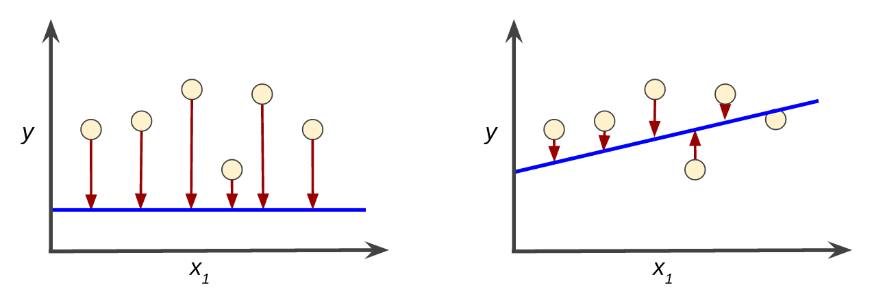
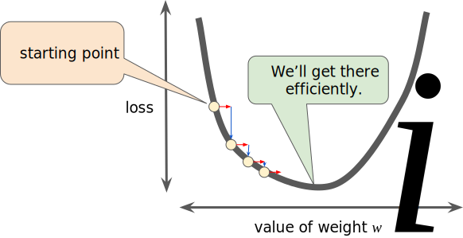

# THE BEGINING

## FRAMING ML with LINEAR REGRESSION

Supervised ML systems learn how to combine input to produce useful predictions on never before seen data.

**Labels**: is the thing we're predicting. It's the `y variable` in linear regression

 

**Features**: is an input variable. It's the `x variable` in linear regression.

 

**Models**: defines the relationship between features and label
- **Training**: creating or learning the model. You show the model labeled examples and enable the model to gradually learn the relationships between features and label

- **Inference**: means applying the trained model to unlabeled examples
 

**Linear Regression**: a `Model` where linear combinations of `Features` are used to precited the `Label`.

where

- : the value we're trying to predict
- : the bias or y-intercept. the value for  when 
- : weigth applied to feature , also known as the slope. for every 1 increase in , also known as the slope. for every 1 increase in ,  increase by that amount
- : the feature

example:

Using the Feature "Chirps per Minute" to precited the Label "Temperature in Celsius". The `Model` is the line.

 

Linear regression can have multiple features all with their own weights:

  

## A LOSS FUNCTION

In supervised learning, a machine learning algorithm builds a model by examining many examples and attempting to find a model that minimizes loss; this process is called **empirical risk minimization**.

**Loss**: is the penalty for a bad prediction

**Mean Squared Error (L2 loss)**: a popular linear regression loss function for continuous labels

where:
-  is an example in which
    -  is the set of features
    -  is the example's label
-  is the output of the function of the weights and bias in combination with the set of features
-  is a data set containing many labeled examples
-  is the number of examples in 

High loss in the left model; low loss in the right model.

  

## REDUCING LOSS: AN ITERATIVE APPROACH

Iterative strategies are common in machine learning because they scale well to large data sets

The simple STEPS:

1) initialise with random `intercept` and `weight` values
2) run model
3) compute the loss
4) update `intercept` and `weights` (parameter update)
5) run model
6) compute the loss
7) continue steps 4 to 6 until convergence (where loss reduces no futher)

So the big question is how does STEP 4 update the `parameters` so loss is reduced and not increased?

An answer is **Gradient Descent**

Regression problems have a lovely property and that is that their **loss function** is **convex** or bowl shaped in relation to their `parameters`. This means we can easily find the **Gradient** of the loss function's slope and adjust the `paramters` so we can iteratively move in a negative direction (down the slope) and therefore reduce the loss to a `global minima`.

**Gradients** have both a `direction` (- or +) and a `magnitude` steepness of slop

  

Unfortunately not all loss functions are convex. **Neural Networks** for example have both a `global` and many `local minima`. Thier loss function might look the the swell of on ocean. This means that they have very strong dependecies on their `initial weights` in STEP 1.

 

### LEARNING RATE

So during STEP 4 when we update the `paramaters`, just how far of a step should we take? This is known as the **Learning Rate** or **Step Size**.

**Learning Rates** are a value (i.e. 0.001, 0.01, 0.1, or 1) that is multipled by the gradent to calcuate how big a step to take. SO if the `gradient magnitude` is 2.5 and the `learning rate` is 0.01, then the gradient descent algorithm will pick the next point 0.025 away from the previous point in the `negative direction`

- Too large a step and we overshoot the `minima`
- Too small a step and we wait years for `convergence`
- Goldilocks step
    - flatter gradients can have large learning rates
    - steeper gradients require smaller learning rates

    

 

### MINI BATCH AND STOCHASTIC GRADIENT DESCENT

The reason **Gradient Descent** scales so well to large datasets is because it can be calculated on just a sample of data.

- **Gradient Descent**: uses all the data to calculate the gradient, slow

- **Stochastic Gradient Descent**: just one sample at a time to calculate the gradient, fast but noisy

- **Mini-Batch Gradient Descent**: batches of 10-1000 to calculate the gradient, good

Checkout http://playground.tensorflow.org/ from Google!

